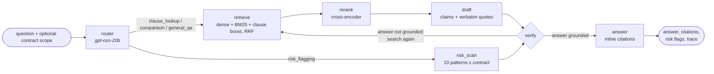

# ClauseWatch

**An agentic RAG system for contract and compliance review.** It answers questions about commercial contracts with clause-level citations, flags risky terms, and compares clauses across documents. It is exposed as a **web app**, a **REST API** and a **standalone MCP server**.

It is built on LangGraph with hybrid retrieval, a cross-encoder reranker, and a two-layer **verifier** that rejects unsupported claims and re-retrieves before anything reaches the user. It is evaluated with **RAGAS** on a hand-written QA set over the [CUAD](https://www.atticusprojectai.org/cuad) contract corpus.


---

## Architecture



| Node | What it does |
|---|---|
| **router** | Structured-output classifier: query type, clause categories, target contracts (resolved against the catalog), and a retrieval query rewritten in contract language. |
| **retrieve** | Hybrid retrieval. Contract/type filters are hard; clause categories are applied as *extra filtered ranked lists* fused with the unfiltered ones (RRF), so tagging misses can't hide evidence. Comparisons take a quota per contract. |
| **rerank** | `BAAI/bge-reranker-base` cross-encoder scores (query, clause) pairs; keeps the top 6 (8 on retries). |
| **draft** | Answers only from numbered sources and emits atomic **claims**, each with source IDs and a **verbatim supporting quote**. It may declare `insufficient_context`. |
| **verify** | **Layer 1 (deterministic):** the quote must appear verbatim (whitespace/punctuation-insensitive) in a cited chunk. **Layer 2 (LLM judge, fresh context):** each claim is judged only against its cited text: supported / partial / unsupported / contradicted. The outcome is PASS, PASS_PRUNED (drop the few unsupported claims) or RETRY with a verifier-proposed query (up to 2 retries); if retries run out it returns only the verified claims or abstains. Every decision is logged in the trace. |
| **risk_scan** | For each of 10 risk patterns (uncapped liability, auto-renewal, one-sided indemnity, one-sided termination, broad IP assignment, restrictive non-compete, change of control, minimum commitment, liquidated damages, unilateral changes): targeted retrieval inside the contract, then an LLM check against explicit criteria. Flags then pass through the same two-layer verifier. |
| **answer** | Renumbers `[S#]` markers to `[1]`, `[2]` and attaches contract, section, page range and the quote for each citation. |

### Serving surfaces

```
                ┌──────────────────────────┐
 Streamlit UI ──►  FastAPI  (/ask /risks …) ──┐
                └──────────────────────────┘  │     ┌─────────────────────────────┐
                                              ├────►  LangGraph agent             │
 Claude Desktop ─► MCP server (stdio / HTTP) ─┘     │  Qdrant  ·  BM25  ·  reranker │
 / any MCP client                                   └─────────────────────────────┘
```

### Stack

| Layer | Choice (swappable via `.env`) |
|---|---|
| Orchestration | LangGraph + LangChain |
| Generator / verifier | `openai/gpt-oss-120b` on Groq (JSON-schema constrained decoding) |
| Router | `openai/gpt-oss-20b` on Groq |
| Eval judges | `openai/gpt-oss-20b` (faithfulness) and `qwen/qwen3.8-27b` (relevancy, context precision) - never the generator itself |
| Embeddings | `BAAI/bge-small-en-v1.5` (local, sentence-transformers) |
| Reranker | `BAAI/bge-reranker-base` cross-encoder (local) |
| Vector DB | Qdrant (embedded local mode, or server via `CLAUSEWATCH_QDRANT_URL`) |
| Sparse | BM25 (`rank-bm25`) with light stemming |
| Eval | RAGAS 0.4 (faithfulness, answer relevancy, context precision) + deterministic checks |
| Serving | MCP Python SDK, FastAPI, Streamlit |

Providers are swappable via `CLAUSEWATCH_LLM_PROVIDER` = `groq` | `anthropic` | `openai` | `ollama`, with no code changes.

---

## Setup

```bash
git clone https://github.com/nsg365/clausewatch && cd clausewatch
python3.12 -m venv .venv && source .venv/bin/activate
pip install -r requirements.txt

cp .env.example .env          # add your free Groq key: https://console.groq.com -> API Keys

python -m clausewatch.cli ingest    # downloads 30 CUAD contracts (+3 held out), chunks, tags, embeds (~2 min)
pytest -q                           # offline tests (no API calls)
```

### Use it

```bash
# CLI
python -m clausewatch.cli contracts
python -m clausewatch.cli ask "Can either party terminate the Biopure agency agreement without cause?"
python -m clausewatch.cli risk path/to/new_contract.pdf       # ingest + risk scan
python -m clausewatch.cli graph                               # print the LangGraph as mermaid

# MCP server (stdio)
python -m clausewatch.mcp_server
```

### Web app

The UI is a thin client over the API, so the two run in **separate terminals** (both need the venv active):

```bash
# terminal 1 - backend; wait for "Application startup complete"
uvicorn clausewatch.api:app --port 8000

# terminal 2 - UI, opens http://localhost:8501
streamlit run app/streamlit_app.py
```

### Claude Desktop

Add to `~/Library/Application Support/Claude/claude_desktop_config.json`:

```json
{
  "mcpServers": {
    "clausewatch": {
      "command": "/absolute/path/to/clausewatch/.venv/bin/python",
      "args": ["-m", "clausewatch.mcp_server"],
      "cwd": "/absolute/path/to/clausewatch"
    }
  }
}
```

---

## MCP tools

| Tool | Input | Output |
|---|---|---|
| `list_contracts` | none | `list[ContractInfo]`: id, title, type, pages, source |
| `query_contracts` | `question`, `contract_ids?` | `QueryResult`: answer, citations[], verification verdict, supported/total claims, retries |
| `flag_risks` | `contract_id`, `top_n=5` | `RiskReport`: ranked flags (pattern, severity, confidence, rationale, quote, section, pages), count rejected by verifier |
| `compare_clauses` | `clause`, `contract_ids` (2 or more) | `QueryResult` |
| `search_clauses` | `query`, `contract_ids?`, `clause_types?`, `top_n=5` | `list[ClauseHit]`: raw hybrid + rerank results, no LLM |
| `ingest_contract` | `pdf_path`, `title?`, `contract_type?` | `ContractInfo` |

Full field-level schemas: [`docs/mcp_tools.md`](docs/mcp_tools.md) (generated from the server by `scripts/dump_mcp_schemas.py`).

---

## Example queries


### 1. The verifier recovers a missed clause

> **Q:** What is the cap on ABG's and the celebrity's total liability in the Papa John's endorsement agreement?

```
[router]   clause_lookup | clauses=['liability'] | contracts=['papajohnsinternationalinc-…']
[retrieve] attempt 0: 30 candidates (dense+BM25, RRF) for 'maximum liability cap for parties and celebrity'
[rerank]   cross-encoder kept 6/30
[draft]    0 claims | model reports insufficient context
[verify]   0/0 claims supported, verdict=INSUFFICIENT -> RETRY
[retrieve] attempt 1: 30 candidates … (clause filter relaxed, verifier query)
[rerank]   cross-encoder kept 8/30
[draft]    1 claims
[verify]   1/1 claims supported, verdict=PASS -> ACCEPT
```

**A:** The agreement caps ABG's and the celebrity's total liability at the amount actually received by ABG under the agreement, excluding any reimbursement of expenses [1].
`[1] PapaJohnsInternationalInc - Endorsement Agreement, 8. Indemnification and Insurance, p. 19`
> "IN NO EVENT SHALL ABG'S, AUTHENTIC BRANDS GROUP LLC'S, AND CELEBRITY'S TOTAL LIABILITY UNDER THIS AGREEMENT EXCEED THE AMOUNTS ACTUALLY RECEIVED BY ABG…"

With the verifier switched off, the same question returns *"Insufficient context to determine the cap…"*, because nothing triggers a second retrieval pass.

### 2. Cross-document comparison

> **Q:** Compare the termination-for-convenience rights in the Biocept collaboration agreement and the Driven Deliveries consulting agreement.

**A:** The Biocept Collaboration Agreement permits termination for convenience by either party with 120 days' written notice, plus a shorter 30-day right if a Change of Control occurs [1]. The Driven Deliveries Consulting Agreement allows either party to terminate with or without cause on 30 days' written notice [2]. …
`[1] BIOCEPTINC - Collaboration Agreement, 11.2 Termination, pp. 21-22` · `[2] DRIVENDELIVERIES,INC - Consulting Agreement, 7.2. Termination, p. 5`
Verifier: 3/3 claims supported.

### 3. Abstention instead of hallucination

> **Q:** What is the data breach notification deadline in the Quaker Chemical non-competition agreement?

The draft reports insufficient context three times: the first retrieval plus two verifier-driven retries.
**A:** *I could not find verifiable support for this in the indexed contracts.* The contract has no such clause.

### 4. Risk flagging on an unseen contract

`python -m clausewatch.cli risk path/to/contract.pdf` ingests the PDF, scans the 10 patterns, and verifies each flag. Output for a held-out CUAD contract:

> **Top 3 risk flags for WARNINGMANAGEMENTSERVICESINC - Endorsement Agreement**
> 1. **One-sided indemnification** (HIGH, 0.97): only the Company indemnifies; there is no reciprocal indemnity.
>    "Company agrees to protect, indemnify and save harmless Pey Dirt, Pey Dirt's agent and Manning … from and against any and all expenses, damages, claims…" (§16 Indemnity, p. 5)
> 2. **One-sided termination** (MEDIUM, 0.93): Pey Dirt alone may terminate if the Company merges or consolidates. This is really a change-of-control trigger.
>    "In the event of the merger or consolidation of Company with any other entity, Pey Dirt shall have the right to terminate…" (§19 Assignment, p. 5)
> 3. **Restrictive exclusivity** (MEDIUM, 0.92): the Company must prevent sales outside the territory, on pain of immediate revocation.
>    "…prevent the sale of any Endorsed Products outside the Contract Territory. Failure of Company to comply … shall entitle Pey Dirt to revoke this license immediately." (§2, p. 1)

On the other held-out contracts the verifier **rejected** 3 of 5 candidate flags. One was an "uncapped liability" flag whose quote does not exist in the contract. Another was a "change of control" flag that ignored an explicit carve-out in the clause. Full output: [`eval/results/risk_demo.md`](eval/results/risk_demo.md).

<!-- RESULTS -->
## Evaluation

Generator: `openai/gpt-oss-120b` (groq) | embeddings: `BAAI/bge-small-en-v1.5` | reranker: `BAAI/bge-reranker-base`

RAGAS judges - context_precision: `qwen/qwen3.8-27b`, faithfulness: `openai/gpt-oss-20b`

### End-to-end (RAGAS + deterministic checks)

| Config | Faithfulness | Answer relevancy | Context precision | Citation grounding | Abstention (unanswerable) | Routing acc. | p50 latency (s) | Tokens / question |
|---|---|---|---|---|---|---|---|---|
| full | 0.94 | 0.85 | 0.88 | 1.00 | 1.00 | 1.00 | 30.60 | 7036 |
| no_verifier | 0.91 | - | - | 0.94 | 1.00 | 1.00 | 17.60 | 4326 |

### Retrieval ablation (18 questions, no LLM)

| Query | Scope | Retriever | Evidence recall@6 | MRR | Hit@1 |
|---|---|---|---|---|---|
| router | scoped | Dense only | 0.89 | 0.78 | 0.67 |
| router | scoped | BM25 only | 1.00 | 0.97 | 0.94 |
| router | scoped | Hybrid (RRF) | 1.00 | 0.87 | 0.78 |
| router | scoped | Hybrid + cross-encoder rerank | 0.94 | 0.92 | 0.89 |
| router | scoped | Hybrid + clause boost + rerank | 0.94 | 0.92 | 0.89 |
| question | scoped | Dense only | 0.92 | 0.84 | 0.78 |
| question | scoped | BM25 only | 0.94 | 0.88 | 0.83 |
| question | scoped | Hybrid (RRF) | 1.00 | 0.86 | 0.78 |
| question | scoped | Hybrid + cross-encoder rerank | 0.92 | 0.84 | 0.78 |
| question | open | Dense only | 0.50 | 0.43 | 0.39 |
| question | open | BM25 only | 0.56 | 0.35 | 0.22 |
| question | open | Hybrid (RRF) | 0.61 | 0.48 | 0.44 |
| question | open | Hybrid + cross-encoder rerank | 0.61 | 0.50 | 0.44 |

Clause tagger vs CUAD expert labels (chunk level): recall 0.52, precision 0.18.


### Risk flagging on held-out contracts

| Contract | Flags | Rejected by verifier | Consistent with CUAD labels |
|---|---|---|---|
| ArmstrongFlooringInc - Intellectual Property Agreement | 1 | 2 | 1/1 |
| N2KINC - Sponsorship Agreement | 1 | 1 | 1/1 |
| WARNINGMANAGEMENTSERVICESINC - Endorsement Agreement | 3 | 0 | 1/2 |

### How to read these numbers

- **20 hand-written questions** over the 30 indexed contracts: 16 single-contract lookups, 2 cross-document
  comparisons, and 2 whose answer is deliberately *absent* from the contract. Every supporting quote in
  `eval/qa_set.jsonl` was checked to exist verbatim in the indexed text before the run.
- **Judges.** RAGAS metrics are LLM-judged. Faithfulness (both configs, so the ablation is like-for-like) is
  judged by `openai/gpt-oss-20b`; answer relevancy and context precision by `qwen/qwen3.8-27b` - both
  different from the generator, which is `openai/gpt-oss-120b`. The judge sees the same labelled sources
  ("Contract: X | Section: Y") the generator saw; without those labels it cannot attribute a clause to a
  contract and scores correct comparison answers as unfaithful.
- **Judge noise is larger than the ablation gap.** Re-scoring identical answers moved individual
  faithfulness scores by up to 0.25, so with n=18 the ~0.03 difference in mean faithfulness is *not*
  meaningful. The deterministic metrics are the trustworthy ones.
- **Citation grounding** is not LLM-judged: it is the fraction of returned citations whose quote appears
  verbatim (whitespace/punctuation-insensitive) in the chunk it cites. This is the metric the verifier is
  designed to protect, and it is where the ablation shows a clean difference.
- **Context precision** is computed over the 6-8 chunks handed to the generator. A low score with a correct
  answer means the right clause ranked late (e.g. q02, where the verifier's second retrieval pass appended
  the decisive clause last).
- Full per-question rows: `eval/results/scores/`. Agent traces: `eval/results/runs/`.
- **Known gap:** q15's context precision was scored before the labelled-context fix (a single-contract
  question, where labels do not change attribution). Re-run `python eval/run_eval.py score --config full
  --only q15 --metrics context_precision --force` to refresh it.

### What the verifier buys

| | Verifier ON | Verifier OFF |
|---|---|---|
| Citation grounding (deterministic) | **1.00** | 0.94 |
| Answers scored 0.00 on faithfulness | **0** | 1 |
| Correct abstentions on unanswerable questions | 2/2 | 2/2 |
| Median latency | 30.6 s | 17.6 s |
| Tokens per question | 7.0k | 4.3k |

The clearest single case is **q02** (cap on total liability). Without the verifier the agent stops at
*"Insufficient context to determine the cap"*. With it, the draft's `insufficient_context` flag triggers a
second retrieval pass with the verifier's own query, and the answer comes back correct and cited. The cost
is roughly 1.7x latency and 1.6x tokens.

<!-- /RESULTS -->

---

## Limitations and next steps

- **Text PDFs only.** Scanned contracts need OCR, which is out of scope.
- **Small eval set.** 20 hand-written questions give directional numbers, not tight confidence intervals. The next step would be to generate a larger set from CUAD's 13k expert spans.
- **Keyword clause tagger.** It recovers about half of CUAD's expert labels, which is why clause categories *boost* results rather than filter them. A small fine-tuned classifier would do better.
- **Risk patterns** are a hand-curated catalog; severity is LLM-assigned and should be calibrated with legal reviewers.
- **Free-tier limits** (Groq: tokens per minute) make the eval slow. Everything is cached and resumable.

## Data and license

Contracts and labels come from **CUAD v1** (Hendrycks et al., 2021), licensed under [CC BY 4.0](https://creativecommons.org/licenses/by/4.0/). This project is for demonstration only and is not legal advice.
